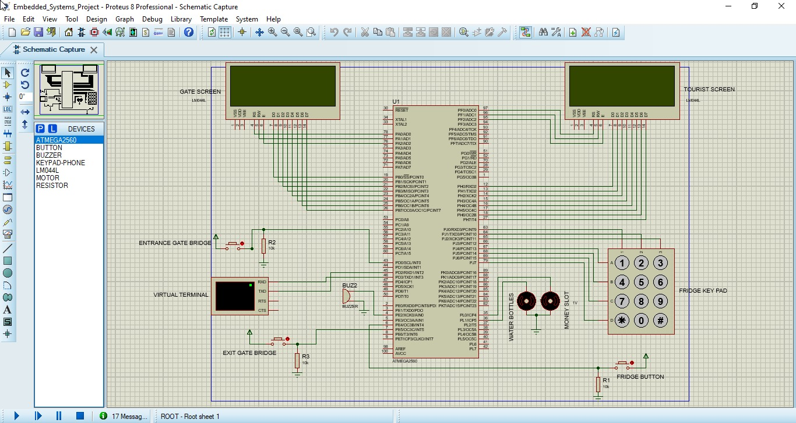
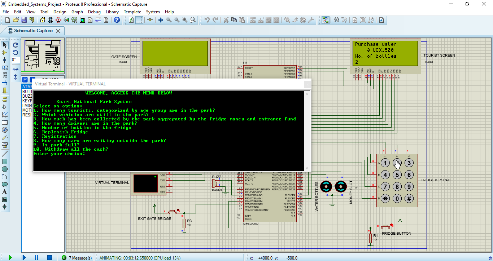

# Smart National Park Tourist System

Automated system for tourist entry, exit, and fee collection in a national park.

## Table of Contents

- [Description](#description)
- [Features](#features)
- [Technologies Used](#technologies-used)
- [Setup](#setup)
- [Usage](#usage)
- [Simulation](#simulation)
- [Images](#images)
- [Contributing](#contributing)
- [License](#license)

## Description

The Smart National Park Tourist System is designed to automate the processes involved in tourist entry, exit, and fee collection within a national park. The system leverages ATmega2560 microcontroller, Microchip Studio for code development, and includes simulation capabilities in Proteus for testing and validation.

## Features

- *Tourist Entry:*
  - Vehicle detection via bridge-triggered interrupt.
  - LCD display of incoming vehicle message.
  - Registration of tourists, including car details and occupants' information.

- *Gate Operation:*
  - Automatic gate opening and closing.

- *Fee Collection:*
  - Water bottle purchase option with cost calculation.
  - Money slot for fund insertion.
  - Water bottle dispensing with a delay.

- *Park Management:*
  - Capacity configuration stored in EEPROM.
  - Monitoring of tourists and vehicles in the park.
  - Aggregated collection information.

- *Security and Configuration:*
  - Password-protected access for the attendant.
  - Configuration storage in EEPROM.

- *Serial Console Menu:*
  - Accessible for various management tasks.

## Technologies Used

- ATmega2560 microcontroller
- Microchip Studio
- Proteus for simulation

## Setup

1. Clone the repository.
2. Configure hardware components, including the ATmega2560 microcontroller.
3. Upload microcontroller code using Microchip Studio.
4. Set initial settings via the serial console.
5. Run the system and monitor events.

## Simulation

Simulate the system in Proteus for testing and validation.

## Usage

- Refer to the LCD screen for real-time events.
- Use the serial console menu for attendant-specific actions.

## Images
### Hardware setup.

### Sample simulation results.

## Contributing

I welcome contributions! If you'd like to contribute to the project, please follow the guidelines below:

- Fork the repository.
- Create a new branch for your contribution.
- Make your changes and commit with descriptive messages.
- Push your branch to your fork.
- Submit a pull request to the `master` branch of the original repository.

Thank you for contributing!
## License

This project is licensed under the [MIT License](LICENSE).
